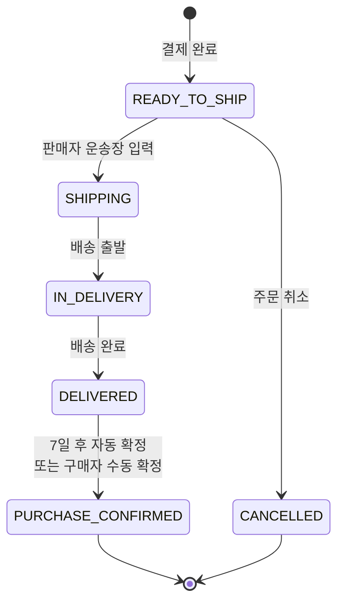

# 5. 배송 상태 머신

```mermaid
stateDiagram-v2
    [*] --> READY_TO_SHIP: 결제 완료

    READY_TO_SHIP --> SHIPPING: 판매자 운송장 입력
    READY_TO_SHIP --> CANCELLED: 주문 취소

    SHIPPING --> IN_DELIVERY: 배송 출발
    IN_DELIVERY --> DELIVERED: 배송 완료

    DELIVERED --> PURCHASE_CONFIRMED: 7일 후 자동 확정<br/>또는 구매자 수동 확정

    PURCHASE_CONFIRMED --> [*]
    CANCELLED --> [*]
```
