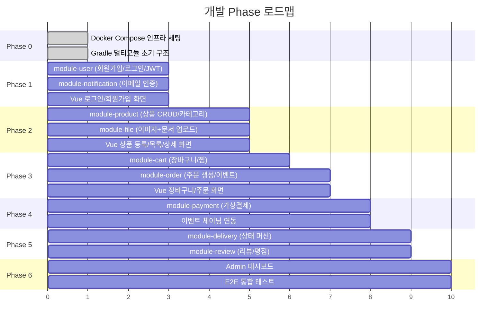

# 8. 개발 Phase 로드맵

```mermaid
gantt
    title 개발 Phase 로드맵
    dateFormat X
    axisFormat %s

    section Phase 0
    Docker Compose 인프라 세팅          :done, p0_1, 0, 1
    Gradle 멀티모듈 초기 구조           :done, p0_2, 0, 1

    section Phase 1
    module-user (회원가입/로그인/JWT)    :p1_1, 1, 3
    module-notification (이메일 인증)    :p1_2, 2, 3
    Vue 로그인/회원가입 화면            :p1_3, 2, 3

    section Phase 2
    module-product (상품 CRUD/카테고리)  :p2_1, 3, 5
    module-file (이미지+문서 업로드)     :p2_2, 3, 5
    Vue 상품 등록/목록/상세 화면         :p2_3, 4, 5

    section Phase 3
    module-cart (장바구니/찜)            :p3_1, 5, 6
    module-order (주문 생성/이벤트)      :p3_2, 5, 7
    Vue 장바구니/주문 화면              :p3_3, 6, 7

    section Phase 4
    module-payment (가상결제)           :p4_1, 7, 8
    이벤트 체이닝 연동                  :p4_2, 7, 8

    section Phase 5
    module-delivery (상태 머신)         :p5_1, 8, 9
    module-review (리뷰/평점)           :p5_2, 8, 9

    section Phase 6
    Admin 대시보드                     :p6_1, 9, 10
    E2E 통합 테스트                    :p6_2, 9, 10
```
