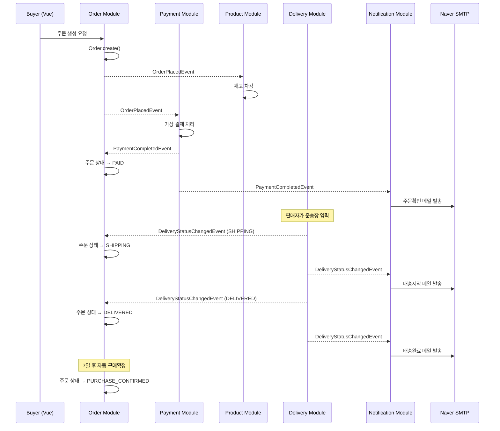

# 3. 이벤트 시퀀스 — 주문 → 결제 → 배송 → 메일

```mermaid
sequenceDiagram
    participant B as Buyer (Vue)
    participant O as Order Module
    participant P as Payment Module
    participant PR as Product Module
    participant D as Delivery Module
    participant N as Notification Module
    participant M as Naver SMTP

    B->>O: 주문 생성 요청
    O->>O: Order.create()
    O-->>PR: OrderPlacedEvent
    PR->>PR: 재고 차감
    O-->>P: OrderPlacedEvent
    P->>P: 가상 결제 처리
    P-->>O: PaymentCompletedEvent
    O->>O: 주문 상태 → PAID
    P-->>N: PaymentCompletedEvent
    N->>M: 주문확인 메일 발송

    Note over D: 판매자가 운송장 입력

    D-->>O: DeliveryStatusChangedEvent (SHIPPING)
    O->>O: 주문 상태 → SHIPPING
    D-->>N: DeliveryStatusChangedEvent
    N->>M: 배송시작 메일 발송

    D-->>O: DeliveryStatusChangedEvent (DELIVERED)
    O->>O: 주문 상태 → DELIVERED
    D-->>N: DeliveryStatusChangedEvent
    N->>M: 배송완료 메일 발송

    Note over O: 7일 후 자동 구매확정
    O->>O: 주문 상태 → PURCHASE_CONFIRMED
```
