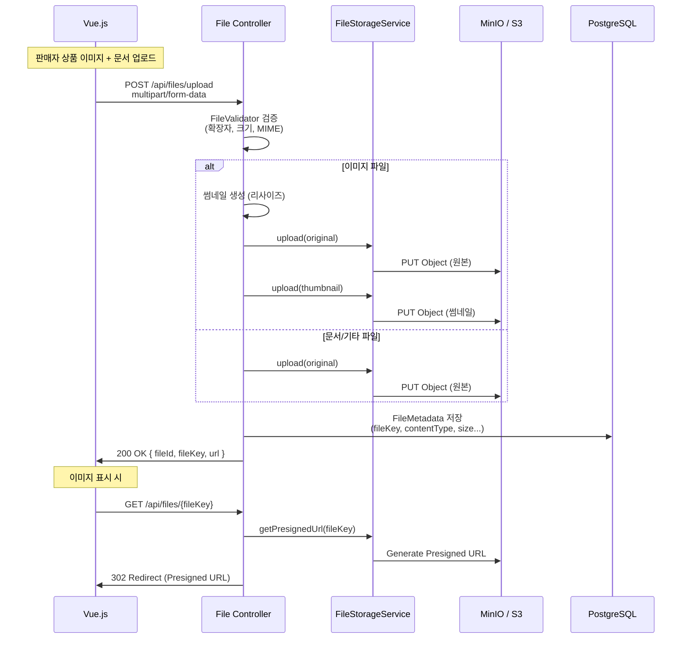

# 6. 파일 업로드 흐름

```mermaid
sequenceDiagram
    participant V as Vue.js
    participant F as File Controller
    participant FS as FileStorageService
    participant M as MinIO / S3
    participant DB as PostgreSQL

    Note over V: 판매자 상품 이미지 + 문서 업로드

    V->>F: POST /api/files/upload<br/>multipart/form-data
    F->>F: FileValidator 검증<br/>(확장자, 크기, MIME)

    alt 이미지 파일
        F->>F: 썸네일 생성 (리사이즈)
        F->>FS: upload(original)
        FS->>M: PUT Object (원본)
        F->>FS: upload(thumbnail)
        FS->>M: PUT Object (썸네일)
    else 문서/기타 파일
        F->>FS: upload(original)
        FS->>M: PUT Object (원본)
    end

    F->>DB: FileMetadata 저장<br/>(fileKey, contentType, size...)
    F->>V: 200 OK { fileId, fileKey, url }

    Note over V: 이미지 표시 시

    V->>F: GET /api/files/{fileKey}
    F->>FS: getPresignedUrl(fileKey)
    FS->>M: Generate Presigned URL
    F->>V: 302 Redirect (Presigned URL)
```
