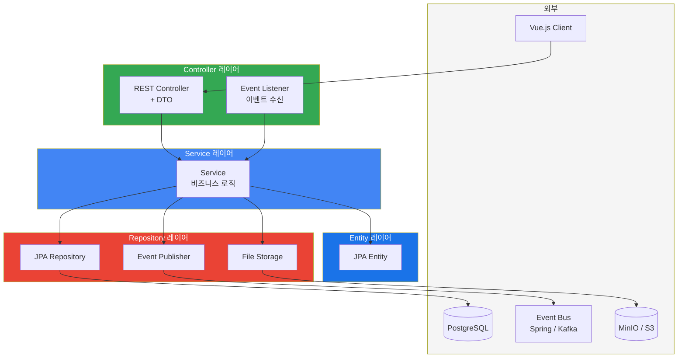

# 4. 레이어드 아키텍처 (모듈 내부 구조)



## 모듈 내부 패키지 구조

```
module-xxx/
└── src/main/java/com/store/xxx/
    ├── controller/     ← REST Controller + DTO
    ├── service/        ← 비즈니스 로직
    ├── repository/     ← JPA Repository
    └── entity/         ← JPA Entity
```
