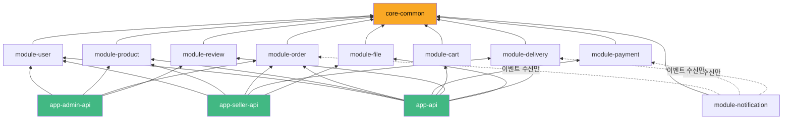

# 7. Gradle 멀티모듈 의존성

```mermaid
graph BT
    CORE[core-common]

    USER[module-user] --> CORE
    PRODUCT[module-product] --> CORE
    ORDER[module-order] --> CORE
    PAYMENT[module-payment] --> CORE
    CART[module-cart] --> CORE
    REVIEW[module-review] --> CORE
    DELIVERY[module-delivery] --> CORE
    FILE[module-file] --> CORE
    NOTI[module-notification] --> CORE

    APP_API[app-api] --> USER & PRODUCT & ORDER & PAYMENT & CART & REVIEW & DELIVERY & FILE
    APP_SELLER[app-seller-api] --> USER & PRODUCT & ORDER & DELIVERY & FILE
    APP_ADMIN[app-admin-api] --> USER & PRODUCT & ORDER & REVIEW

    NOTI -.->|이벤트 수신만| ORDER & PAYMENT & DELIVERY

    style CORE fill:#f9a825,color:#000
    style APP_API fill:#42b883,color:#fff
    style APP_SELLER fill:#42b883,color:#fff
    style APP_ADMIN fill:#42b883,color:#fff
```
