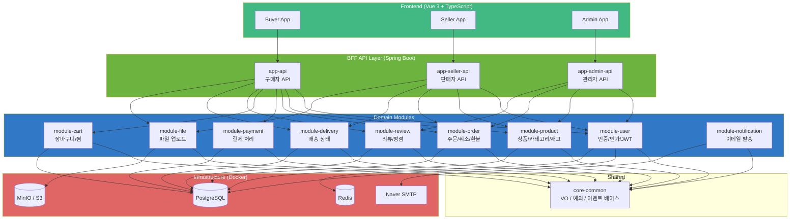

# 1. 전체 시스템 아키텍처

```mermaid
graph TB
    subgraph Frontend["Frontend (Vue 3 + TypeScript)"]
        BUYER[Buyer App]
        SELLER[Seller App]
        ADMIN[Admin App]
    end

    subgraph BFF["BFF API Layer (Spring Boot)"]
        API_BUYER[app-api<br/>구매자 API]
        API_SELLER[app-seller-api<br/>판매자 API]
        API_ADMIN[app-admin-api<br/>관리자 API]
    end

    subgraph Modules["Domain Modules"]
        USER[module-user<br/>인증/인가/JWT]
        PRODUCT[module-product<br/>상품/카테고리/재고]
        ORDER[module-order<br/>주문/취소/환불]
        PAYMENT[module-payment<br/>결제 처리]
        CART[module-cart<br/>장바구니/찜]
        REVIEW[module-review<br/>리뷰/평점]
        DELIVERY[module-delivery<br/>배송 상태]
        FILE[module-file<br/>파일 업로드]
        NOTI[module-notification<br/>이메일 발송]
    end

    subgraph Common["Shared"]
        CORE[core-common<br/>VO / 예외 / 이벤트 베이스]
    end

    subgraph Infra["Infrastructure (Docker)"]
        PG[(PostgreSQL)]
        REDIS[(Redis)]
        MINIO[(MinIO / S3)]
        NAVER_SMTP[Naver SMTP]
    end

    BUYER --> API_BUYER
    SELLER --> API_SELLER
    ADMIN --> API_ADMIN

    API_BUYER --> USER & PRODUCT & ORDER & PAYMENT & CART & REVIEW & DELIVERY & FILE
    API_SELLER --> USER & PRODUCT & ORDER & DELIVERY & FILE
    API_ADMIN --> USER & PRODUCT & ORDER & REVIEW

    USER --> CORE
    PRODUCT --> CORE
    ORDER --> CORE
    PAYMENT --> CORE
    CART --> CORE
    REVIEW --> CORE
    DELIVERY --> CORE
    FILE --> CORE
    NOTI --> CORE

    USER & PRODUCT & ORDER & PAYMENT & CART & REVIEW & DELIVERY --> PG
    USER --> REDIS
    FILE --> MINIO
    NOTI --> NAVER_SMTP

    style Frontend fill:#42b883,color:#fff
    style BFF fill:#6db33f,color:#fff
    style Modules fill:#3178c6,color:#fff
    style Infra fill:#e06666,color:#fff
```
